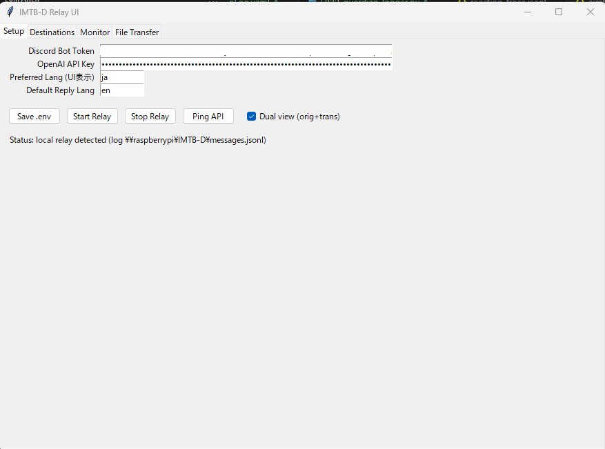
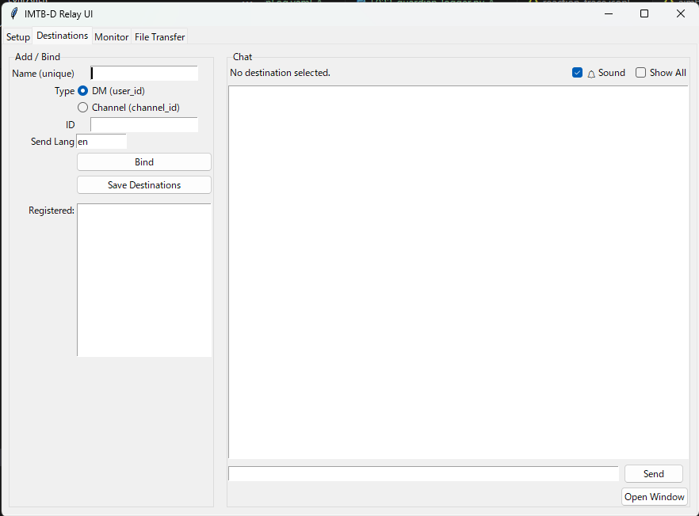
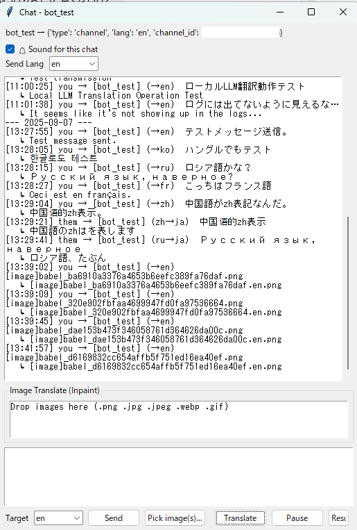
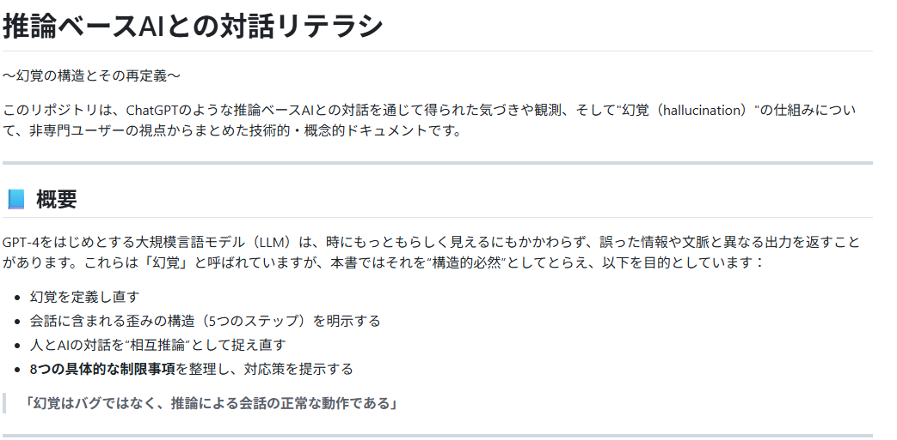
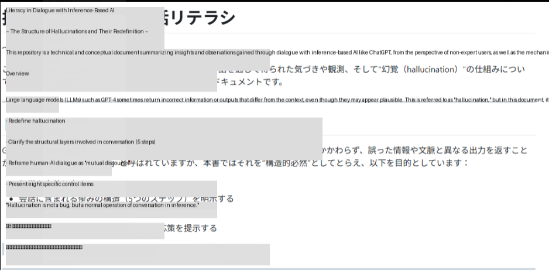

## Traducteur Multilingue Interactif BOT pour Discord (IMTB-D)

Un outil qui regroupe un **Bot de traduction Relay** capable de traduire et d'écrire des messages Discord dans la **langue de votre choix**, une **UI de bureau (Tkinter)** pour le contrôler depuis votre ordinateur, et une **Console** utilisable depuis le terminal.  
Les journaux de traduction peuvent être sauvegardés en **JSONL**, et un chemin de partage UNC (ex: `\\raspberrypi\IMTB-D\messages.jsonl`) peut également être spécifié.

- **Relay** : Bot Discord et API HTTP locale (`/bind`, `/send`, `/send_image`, `/stats`)

- **Ajout de Relay r3** : **`/translate`** (reçoit du texte via HTTP et renvoie **la traduction via HTTP**)

- **UI** : Édition de .env, enregistrement et envoi de destinations, consultation des journaux, **traduction de fichiers (aperçu en direct)**, démarrage automatique de Relay en mode local

- **Console** : Liaison et envoi depuis le terminal. Affichage des journaux en temps réel

> Nécessaire : **Token de Bot Discord** et **Clé API OpenAI** (une configuration sans appel direct à OpenAI est également acceptable)

---

## Table des matières

- [Configuration](#configuration)

- [Exigences](#exigences)

- [.env (exemple minimal)](#env-exemple-minimal)

- [Utilisation](#utilisation)
  
  - [A. Utiliser UI + Relay localement](#a-utiliser-ui--relay-localement)
  
  - [B. Se connecter à un Relay distant](#b-se-connecter-à-un-relay-distant)
  
  - [C. Console (terminal)](#c-console-terminal)

- [API (Relay)](#api-relay)
  
  - [/translate (nouveau r3)](#translate-nouveau-r3)
  
  - [/bind, /send, /send_image, /stats](#bind-send-send_image-stats)

- [Journaux (JSONL)](#journaux-jsonl)

- [Exemple d'intégration avec VS Code](#exemple-dintégration-avec-vs-code)

- [Questions fréquentes](#questions-fréquemment-posées)

- [Conseils de développement/exploitation](#conseils-de-développementexploitation)

- [Licence](#licence)

---

## Configuration (fichiers principaux)

```
IMTB-D_relay.py      # Bot Discord + API HTTP
IMTB-D_ui.py         # UI de bureau (Tkinter)
IMTB-D_console.py    # Console pour terminal
console_routes.json      # Enregistrement des destinations (écrit par l'UI)
log/messages.jsonl       # Journaux de traduction (JSON Lines)
```

---

## Exigences

- Télécharger les fichiers principaux
- Python 3.10+ (environnement avec Tkinter)
- `pip install -r requirements.txt` 

```bash
pip install -r requirements.txt
```

---

## .env (exemple minimal)

Créez un fichier `.env` à la racine de ce dépôt.

```ini
DISCORD_BOT_TOKEN=xxxxxxxxxxxxxxxxxxxxxxxxxxxxxxxxxxxxxxxxxxxxxxxx
OPENAI_API_KEY=sk-********************************

# URL de base pour Relay (recommandé 127.0.0.1 lors de l'utilisation locale de l'UI)
IMTBD_API_BASE=http://127.0.0.1:8765

# Configuration de liaison (Listen) pour Relay (par défaut : 127.0.0.1:8765 si non configuré)
RELAY_HOST=127.0.0.1
RELAY_PORT=8765

# (optionnel) Chemin de sauvegarde des journaux de traduction
IMTBD_JSONL_PATH=\\\\raspberrypi\\IMTB-D\\messages.jsonl

# (optionnel) Paramètres liés à la traduction
OPENAI_MODEL=gpt-4o-mini
PREFERRED_LANG=ja
DEFAULT_REPLY_LANG=en
```

> Lors de l'utilisation de UNC sur Linux/mac, il est préférable de monter au préalable et de spécifier le chemin normal. *Notez que IMTBD_JSONL_PATH est **sensible à la casse** (Linux)*

---

## Utilisation

### A. Utiliser UI + Relay localement (le plus court)

```bash
python IMTB-D_ui.py
```

- Si `IMTBD_API_BASE` est `http://127.0.0.1:8765` ou `localhost`,  
  l'UI **aide automatiquement au démarrage de Relay** (après le démarrage, "API ready" s'affiche).
  
  
  
  Éditez `.env` depuis l'onglet « Setup » et **enregistrez .env**.

- Dans l'onglet « Destinations », **Liez** une destination (DM/Channel) → saisissez le texte → **Envoyez**.
  
  

- Les envois et réceptions sont reflétés dans le journal en bas.
  
  - Cliquez sur « Open Window » tout en ayant une destination (DM/Channel) sélectionnée → une fenêtre de chat individuelle s'ouvre.
    
    
  
  - Traduction de texte
    
    - Saisissez le texte dans la boîte en bas de la fenêtre et appuyez sur send ou Enter pour l'envoyer.
    
    - Pour saisir plusieurs lignes, utilisez Ctrl+Enter pour un saut de ligne.
  
  - Traduction d'images (Inpaint)
    
    - Faites glisser et déposez une image pour effectuer une traduction d'image par inpainting.
    
    - À ce stade, le résultat n'est pas très propre, mais peut servir de référence.
      
      Avant traduction
      
      
      
      Après traduction
      
      

### B. Se connecter à un Relay distant (ex: Raspberry Pi)

- Démarrez `IMTB-D_relay.py` sur le serveur (Pi, etc.),
- Modifiez le `.env` de l'UI pour que `IMTBD_API_BASE` soit `http://<server-ip>:8765`.  
- Dans ce cas, le démarrage/arrêt de l'UI est désactivé et fonctionne en **mode distant**.

### C. Console (terminal)

```bash
# Vers un canal
python IMTB-D_console.py --name general --channel 123456789012345678 --lang en

# Vers un DM
python IMTB-D_console.py --name bob --dm 987654321098765432 --lang en

# Tapez directement dans l'entrée standard pour envoyer (les journaux sont affichés en temps réel).
```

---

## API (Relay)

### `/translate` (nouveau r3)

**API générique qui traduit le texte reçu via HTTP et renvoie la traduction via HTTP**. Ne passe pas par Discord.

- **POST** `/translate`

- **Request (JSON)**:
  
  `{ "text": "Hello world", "source": "en", "target": "ja" }`
  
  - `source`: `"en" | "ja" | "auto" | ""` (non spécifié/auto/vide est automatiquement déterminé en interne)
  
  - `target`: par défaut, c'est `DEFAULT_REPLY_LANG` dans `.env` (ex: `"ja"`)

- **Response (JSON)**:
  
  `{ "ok": true, "translated": "こんにちは世界", "source": "en", "target": "ja" }`

- **Exemple : curl**
  
  `curl -sS -X POST "http://<server-ip>:8765/translate" \   -H "Content-Type: application/json" \   -d '{"text":"Hello","source":"en","target":"ja"}'`

- **Exemple : PowerShell**
  
  `$b = @{ text="Hello"; source="en"; target="ja" } | ConvertTo-Json Invoke-RestMethod -Uri "http://<server-ip>:8765/translate" -Method Post -ContentType "application/json" -Body $b`

#### Promesse de retour

- Lorsque `ok` est `true`, `translated` contient la traduction

- En cas d'échec, renvoie `{ "ok": false, "error": "<message>" }` (HTTP 4xx/5xx)

---

### `/bind`, `/send`, `/send_image`, `/stats`

- `POST /bind` — Enregistre le nom de la console et la destination (dm/channel, id, lang, etc.)

- `POST /send` — Envoie du texte à la console spécifiée (livré à Discord)

- `POST /send_image` — OCR d'image → traduction → inpainting → envoi

- `GET /stats` — État de démarrage et liste des liaisons> `/translate` est **idéal pour répondre directement aux clients HTTP**, ce qui le rend parfait pour l'intégration avec des outils externes comme VS Code. Le flux traditionnel via Discord utilise `/bind` et `/send`.

---

## Logs (JSONL)

- Par défaut : `log/messages.jsonl`. Vous pouvez changer le chemin de sauvegarde dans `.env` avec `IMTBD_JSONL_PATH`.  
- L'interface utilisateur suit ce fichier pour l'affichage à l'écran. Il est également accessible via un partage UNC.

---

## Exemple d'intégration avec le wrapper VS Code

- Configuration côté extension : `mikeWrapper.endpoint = http://<server-ip>:8765/translate`

- Sélection → **Remplacer la sélection par le japonais** (ex : `Ctrl+Alt+K`) pour **un remplacement sur place**

- La traduction du presse-papiers (`Ctrl+Alt+J`), la traduction au survol, etc., sont conformes aux paramètres de l'extension.

---

## Questions fréquentes (FAQ)

**Q : Comment écrire un chemin UNC sous Windows ?**  
R : Dans `.env`, écrivez `\\raspberrypi\IMTB-D\messages.jsonl` avec **deux barres obliques inverses**.  
   En raison de l'échappement dans `.env`, il est préférable d'écrire `\\\\raspberrypi\\IMTB-D\\messages.jsonl`.

**Q : `fetch failed` apparaît**  
R : Il se peut que `localhost` soit résolu en IPv6 et ne puisse pas se connecter. Essayez avec **`127.0.0.1`**. Pour une connexion distante, utilisez `<server-ip>`.

**Q : Permission denied (écriture dans `console_routes.json`)**  
R : Cela peut être dû à l'éditeur qui a le fichier ouvert (exclusif) ou à l'accès contrôlé aux dossiers de Windows. Changez le chemin de sauvegarde vers le répertoire utilisateur ou fermez l'éditeur et réexécutez.

---

## Conseils de développement/production

- **Hot reload de r3** (redémarrage à la sauvegarde)
  
  `pip install watchdog watchmedo auto-restart -p "*.py" -d . -- python IMTB-D_relay_r3.py`

- **Démarrage en arrière-plan (Linux, systemd)**
  
  `# /etc/systemd/system/imtb-relay.service [Unit] Description=IMTB-D Relay r3 After=network-online.target [Service] WorkingDirectory=/home/<user>/IMTB-D ExecStart=/home/<user>/IMTB-D/venv/bin/python IMTB-D_relay_r3.py Restart=always RestartSec=2 Environment=RELAY_HOST=0.0.0.0 RELAY_PORT=8765 [Install] WantedBy=multi-user.target`

- **Utilisation de Git**
  
  - Commitez l'implémentation de `/translate`, le README et le CHANGELOG.
  
  - Ne commitez pas `.env` (fournissez `.env.example`).
  
  - En principe, ignorez `.vscode/`. Si vous souhaitez partager, ne partagez que le minimum sans informations sensibles, comme `extensions.json`/`tasks.json`, etc.

---

## Licence

Licence MIT